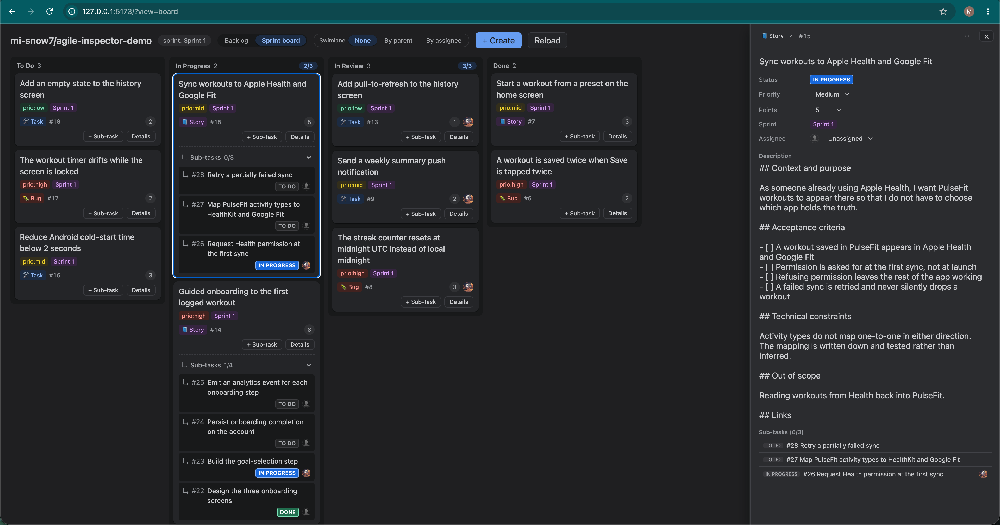
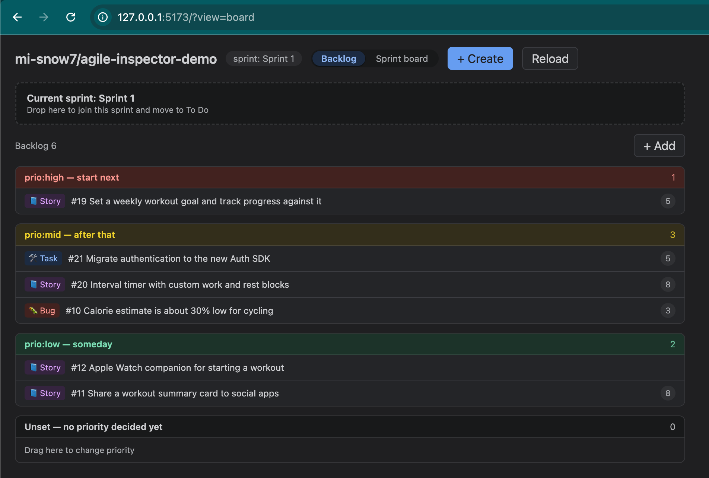
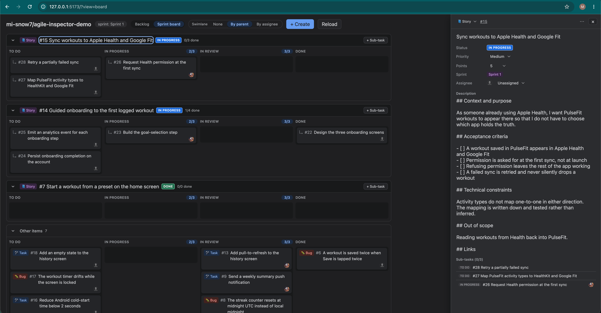
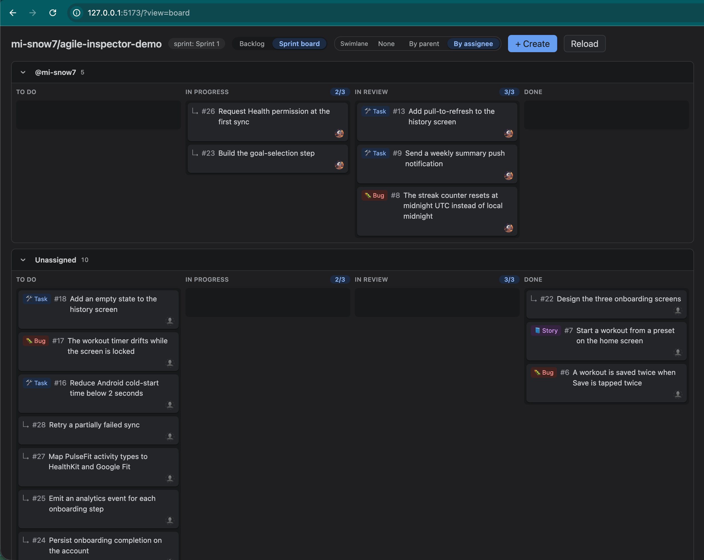

# agile-inspector

*English / [日本語](README.ja.md)*

**A Claude Code plugin: the scrum master a team hasn't got.**

Nine slash commands chair the ceremonies and keep the board — `/agile:standup`
for the daily, `/agile:refine` for backlog refinement, `/agile:retro` for KPT,
`/agile:sprint-start` and `/agile:sprint-close` for a sprint, plus
`/agile:board`, `/agile:backlog` and `/agile:issue` for the work itself, and
`/agile:init` to set it all up. The tracker behind them is **GitHub Issues or
Jira**, in kanban or sprint mode, chosen at `/agile:init` and recorded in
`.agile/config.yml`.

It lets a team with no dedicated scrum master — and no particular experience
with agile — run those properly and in order. **The decisions stay the team's:
the AI chairs and records, and does not go near the implementation.**

Anything that fits in a conversation is handled as text; anything that means
comparing several things at once gets a board — a local, drag-and-drop one on
GitHub Issues, Jira's own where the team is on Jira.



<table>
<tr>
<td width="33%"><a href="docs/images/backlog.png"></a></td>
<td width="33%"><a href="docs/images/swimlane_by_parent.png"></a></td>
<td width="33%"><a href="docs/images/swimlane_by_assignee.png"></a></td>
</tr>
<tr>
<td><b>Backlog</b> — dragging a row between priority buckets is what reprioritising means here</td>
<td><b>By parent</b> — how close each story is to done</td>
<td><b>By assignee</b> — who is holding what, for the daily</td>
</tr>
</table>

> The screens above are a demo repository. **The language follows `locale` in
> `.agile/config.yml`** — this one is set to `en`.

It takes no view on who writes the code. However much of it now comes from an AI,
**what to build, what to commit to, and what counts as done** stay the team's
calls — and that is where agile does its work.

> **This has a different purpose from an orchestration tool that hands whole
> issues to AI agents.** However much of the code is generated, **committing to a
> goal for a fixed period, making the technical calls, and delivering something
> that runs** stay with the team. What this plugin takes on is the chairing and
> the board-keeping, so that the team's time goes to the calls.

**Everything the plugin holds anyone to is something the team decided.** WIP
limits, the Definition of Done, the sprint length, the language it speaks — all
of it lives in `.agile/`, committed to the repository and edited by the team. The
plugin follows those; it brings no rules of its own.

## Backends

**Use the tracker the team already has.** No item data is stored locally —
`.agile/` holds only what the team has agreed on (mode, WIP limits, the
Definition of Done, templates).

| | The screen | Writing state | Auth |
|---|---|---|---|
| **GitHub Issues** | this plugin provides one (a local visual board) | yes | `gh` CLI |
| **Jira** | **Jira's own — we only open it** | **no; the team moves cards in Jira** | `acli` (browser login) |

**On Jira, column moves are left to the team by design.** Changing state there is
a workflow transition, so "drag it anywhere" cannot hold — leaving the move to
Jira keeps the plugin out of the way of transition rules the team has already
set up, and it is where they move cards anyway. The same holds for **priority,
estimates and sprint membership**: planning opens Jira's own backlog, the team
arranges it, and the plugin **reads the result back and confirms it**. **Inspection (WIP overruns, stalled work, replenishment) and the facilitation of
each ceremony work the same way on both backends.**

The mechanics live in `plugins/agile/docs/backends/`, and **the skills
themselves contain no commands at all** (`README.md` is the contract,
`github.md` and `jira.md` are the implementations).

> **What Jira support was verified against**: **team-managed projects**.
> Company-managed is untested — standing an instance up needs organisation
> admin. `/agile:init` detects the difference and says so before continuing.
> Reports of it going wrong are very welcome.

### Why drive the tracker directly (the GitHub Issues case)

- **No commit or PR to update anything**: an issue lives outside the git tree,
  so moving a column or closing something never appears in the commit history.
- **It does not split under many hands**: one issue is one object. No merge
  conflicts, and assignment and notifications come for free.
- **It works solo**: growing into a team later changes nothing.
- **Driven by the `gh` CLI**: no MCP kept loaded, zero context cost,
  deterministic.

Jira follows the same principle — **`acli` and REST only, no MCP**.

## The plugin: `agile`

| Skill | What it does |
|---|---|
| `/agile:init` | Picks the backend, sets up whatever classification it needs, writes local settings to `.agile/config.yml` (mode, WIP limits, To Do minimum, stale threshold), places the item templates and agrees the DoD. **Re-running touches nothing that exists and only adds what is missing** |
| `/agile:issue` | Adds, edits or removes **a single item** (Story / Task / Bug). Judges the type from the request; shapes a Story into persona form with acceptance criteria, and a Bug into reproduction steps |
| `/agile:board` | **Shows the board and moves items between columns.** Opens the board for the current mode (sprint board or kanban board) and summarises it in text as well. Checks WIP, replenishment and stalls. Filing belongs to `/agile:issue`, which it delegates to on the spot |
| `/agile:backlog` | **Shows the backlog and changes priority.** Lists it by priority bucket and opens the backlog screen |
| `/agile:standup` | **Facilitates the daily.** Opens the board, fills in each person's "since last time / today" in advance from item state and recent commits and merged PRs, then goes round — person by person in sprint mode, right to left across the board in kanban. Catches blockers and closes with a summary |
| `/agile:refine` | **Backlog refinement.** A ceremony: takes its time over the backlog, reprioritising, adding and removing, splitting, clarifying acceptance criteria and estimating. Run weekly or so |
| `/agile:retro` | **Runs the retrospective (KPT).** Opens whichever surface the team uses, and chairs Keep → Problem → Try one round at a time while people write. Clears last round's unfinished Try, revisits the DoD, turns an adopted Try into a work item, writes the minutes. **Runs in kanban mode too**, on a cadence the team picks |
| `/agile:sprint-start` | **[sprint only] Sprint planning.** Drafts the goal, selects the items against it, confirms the goal, breaks work into sub-tasks. **Assigns nobody** — owners are decided when work is picked up, at the daily |
| `/agile:sprint-close` | **[sprint only] Sprint review.** Demo list and feedback into the backlog, retrospective delegated to `/agile:retro`, unfinished work returned to the backlog with a progress note. Does not start the next sprint |

Only `sprint-start` and `sprint-close` are sprint-only; **the rest work in both
modes.**

The entry points divide by **what you are acting on** — one item is
`/agile:issue`, the board is `/agile:board`, the backlog is `/agile:backlog`,
and each ceremony has its own command.

### The ceremonies are chaired, not summarised

`standup`, `refine`, `retro`, `sprint-start` and `sprint-close` do not print a
result and stop. **The AI facilitates, one step at a time, confirming as it
goes** — so that a team with no scrum master, or no experience of the format,
can still run the meeting properly. That is the entire point of the tool.

The intended shape is **reading the chat while watching the board in another
window**:

```
Terminal / Claude Desktop            Browser (board-ui)
┌──────────────────────┐  ┌──────────────────────────┐
│ AI chairs and records │  │ swimlane by assignee      │
│ one person at a time  │  │ drag cards between columns│
└──────────────────────┘  └──────────────────────────┘
```

The AI concentrates on facilitating and recording; people concentrate on the
cards. Window placement is the operating system's business, not the plugin's.

The AI opens whatever screen a step needs. **Whether to open one is decided per
step, not per command** — `refine` opens the backlog, `sprint-start` opens the
backlog to select and the board to break down, and `sprint-close` opens nothing
while it is producing a demo list.

The visual board is not a command of its own; **the skills above open it when a
step calls for it**. It has three screens.

| Screen | Opened by | For |
|---|---|---|
| Backlog | `/agile:backlog`, `/agile:refine`, `/agile:sprint-start` (selection) | Dragging between priority buckets, pulling items into a sprint |
| Board | `/agile:board`, `/agile:standup`, `/agile:sprint-start` (breakdown) | Moving columns, working through swimlanes |
| Retrospective | `/agile:retro`, `/agile:sprint-close` | Writing KPT cards, dragging between Keep / Problem / Try |

The backlog and the board are daily screens; **the retrospective exists only
during the ceremony.** Everyone writes their own cards, so **participants run
`/agile:retro` themselves** — watching the facilitator's screen is not enough.

**The retrospective screen does not switch to the backlog or the board.** That
restriction is deliberate: it keeps a participant from moving a real item by
accident during the meeting. If someone wants the backlog mid-ceremony, the
skill opens it as a separate screen — **that route knows which
backend the project uses**, so on Jira it opens Jira's backlog.

### Where the retrospective happens

**An axis of its own, independent of the backend.** A team on GitHub may well
prefer FigJam; a team on Jira may well prefer this plugin's board. `/agile:init`
asks, and the answer is a committed team agreement rather than a per-person
setting.

| `retro.board` | What it means |
|---|---|
| `builtin` | The KPT screen above. **Cards are stored as issues in this repository**, whatever the work backend is |
| `external` | A whiteboard the team already uses — FigJam, Miro, Confluence. **We open the URL and never call its API**; the team pastes each lane in when the round is done |
| `chat` | No screen at all. Keep, Problem and Try are collected in the conversation |

**On Jira, `builtin` is worth considering even though the work lives elsewhere.**
Jira has no KPT board — the usual workarounds are a Confluence page, or issues
of a retrospective type, which makes the backlog harder to read. Stickies held as
issues in the GitHub repository **add nothing to Jira at all**, so the backlog
stays work and only work. Stickies as issues in the
GitHub repository stay out of Jira entirely, and an adopted Try is still filed
**in Jira**, carrying a link back to the sticky it came from. It needs `gh` auth
and the repository to have Issues enabled; where that does not hold,
`external` is the default.

With `external`, nothing is stored by us and nothing is read from the
whiteboard's API — **the clipboard is the entire integration**. That is
deliberate: it works with any tool, including the one the team switches to next
year.

The backlog and board screens have a **Create** button in the header, with a
type selector. Chat and screen act on the same data, so it makes no difference
which you use.

### Boards and swimlanes

"Agile board" is the umbrella. Under it sit the **sprint board** (cut into
periods, finish what was promised) and the **kanban board** (no boundary, keep
the flow moving). The rules are opposites, so no team runs both — which is why
`/agile:board` takes no argument and reads `mode` instead.

A swimlane groups the cards into horizontal rows, switchable from the top right.
**Which lanes exist depends on the mode.**

| Mode | Lane | For |
|---|---|---|
| both | **none** (default) | The plain board. Start here |
| sprint | **by assignee** | The daily standup — who holds what, where it is stuck, whether the load has skewed |
| sprint | **by parent** | Progress during the day — per story, what is left |
| kanban | **expedite** | Three lanes: expedite / standard / background. Keeps incidents and critical bugs from being buried |

Kanban has no assignee lane: it is pull-based — whoever is free takes the next
item — and slicing by person hides the one thing kanban exists to show, which
column the work is piling up in. The cards that move through columns are always
**units of work** (sub-tasks, and any Story/Task/Bug never broken down); a
parent with children is a container, and becomes the row heading.

## How columns are represented (GitHub Issues — the label scheme)

| Column | Issue state |
|---|---|
| Backlog | open, no `status:*` label |
| To Do | open + `status:todo` |
| In Progress | open + `status:in-progress` |
| In Review | open + `status:in-review` |
| Done | **closed** |

The column names follow Jira's, and **the labels are named to match what is
displayed** — labels are visible on GitHub itself, where nothing translates an
internal name into a display name.

In sprint mode a GitHub **Milestone** is one sprint.

The hierarchy is two levels, as in Jira. **Story, Task and Bug are peers**: all
three sit in the product backlog and enter a sprint. A **sub-task** hangs off one
of them and never exists alone.

| Type | Role | Example |
|---|---|---|
| `type:story` | A requirement that delivers value to a user | "See my purchase history as a member" |
| `type:task` | Technical or operational work | "Upgrade to Node 22" |
| `type:bug` | A defect that needs fixing | "The list goes empty under some conditions" |
| `type:subtask` | The smallest unit, broken out of one of the above | "Implement the history API" |

`type:kpt` is **not part of this hierarchy** — it only represents a
retrospective sticky as an issue, and being not-work it is excluded from the
board, the backlog and every count. Only an adopted Try drops `type:kpt`, becomes
`type:task` + `kaizen`, and joins the ordinary flow.

### The labels `/agile:init` creates

Five families — `status`, `prio`, `type`, `kpt`, `points` — plus `kaizen` and
`carried-over` on their own: **21 labels**. All created idempotently, so
re-running breaks nothing.

| Family | Labels | Role | Mostly changed by |
|---|---|---|---|
| status | `status:todo` `status:in-progress` `status:in-review` | Board columns (none = Backlog, closed = Done) | `/agile:board` |
| prio | `prio:high` `prio:mid` `prio:low` | Backlog priority buckets | `/agile:backlog` |
| type | `type:story` `type:task` `type:bug` `type:subtask` `type:kpt` | Item type (see the table above) | `/agile:issue` |
| points | `points:1` `points:2` `points:3` `points:5` `points:8` | Story points (Fibonacci) | `/agile:refine` |
| kpt | `kpt:keep` `kpt:problem` `kpt:try` | Which bucket a retrospective sticky is in | `/agile:retro` |
| — | `kaizen` | Marks an improvement adopted at a retrospective | `/agile:retro` |
| — | `carried-over` | Unfinished work from the last sprint, re-evaluated at planning | `/agile:sprint-close` → `/agile:sprint-start` |

**Points are optional.** Where they exist they feed the bucket totals in
`/agile:backlog`, the velocity guide in `/agile:sprint-start`, and the completed
total in `/agile:sprint-close`. Without them everything still runs on counts, so
a team that does not estimate can simply not.

**Sub-tasks never sit in the product backlog.** In sprint mode, only items
already **in the sprint** can be broken down — decomposing something that may
never be started is wasted work. Kanban has no such restriction.

The unit moved day to day is **a sub-task, or a Task/Bug never broken down**; the
unit of delivered value is **a story**. The board nests children under parents,
and when every child is finished it *suggests* moving the parent to review —
never automatically, because the acceptance criteria and the DoD still have to
be checked.

## Kanban mode

Unlike sprint mode there is **no boundary at which to plan or reflect**. These
signals keep the flow instead.

| Signal | Setting | Behaviour |
|---|---|---|
| Replenishment | `wip_limit.todo_min` (default 2) | When To Do drops below it, `/agile:board` offers to replenish from `/agile:backlog` |
| WIP limits | `wip_limit.doing` / `review` | Warns on overrun. Counted in units of work — a Story, and any parent with children, is a container and is not counted |
| Stall detection | `stale_days` (default 7) | Flags anything that has sat that long in progress or review. **Measured on time in the column** where the backend records it (Jira); where it does not, the last-touched time stands in and is labelled as such (GitHub) |
| The improvement loop | — | Run `/agile:retro` on **a cadence you choose** — with no boundary, an undecided cadence means it never happens |

Every setting is optional; an older `.agile/config.yml` without them runs on the
defaults.

## The `experimental:` block

`experimental:` in `.agile/config.yml` is where settings **under trial** live.
Keys there **may change or disappear without notice**. If one disappears the
behaviour reverts to the default, and items, labels and sprints are unaffected.
Anything that settles moves up a level, with a migration note in the changelog.

| Key | Default | Behaviour |
|---|---|---|
| `require_subtasks_done` | `false` | `true` prevents finishing a parent while sub-tasks remain open — enforced in the board UI, in `/agile:board` and in the API alike |

The default follows Jira, which also lets you close a parent and expects a
workflow validator when you would rather it did not. **Even at `false`, a
finished parent with open children is flagged on the card** regardless of the
setting — an item closed directly in the backend cannot be stopped at any
setting, so the split is: **what cannot be prevented gets noticed.**

## Item templates (`.agile/templates/`)

Item bodies are **written from a template, not assembled from a form**. Jira's
create screen asks for a summary and a description and no more, for good reason:
the more a form is split into separate fields — persona, capability, value,
acceptance criteria — the more boxes have to be filled to write one paragraph,
and the more work filing becomes.

`/agile:init` writes `story.md`, `task.md` and `bug.md` in the agreed `locale`,
and **the team edits them freely** from then on — the same treatment as
`definition_of_done.md`, because how to write an item is the team's decision, not
the plugin's. The board's **Create** button and `/agile:issue` read the same
files, so an item filed from either comes out the same shape. If the files are
missing, the locale default applies, so a project initialised before templates
existed still works — running `/agile:init` again adds only what is missing.

The edit screen **shows the body as it is**. Nothing is parsed apart and
reassembled, so text added on the backend's own site is never lost on save.

## Issue body structure (GitHub Issues — the `<!-- agile:* -->` markers)

Only the parts of a body **the tool reads back** carry an HTML-comment marker,
invisible on GitHub. There are exactly two, both written automatically **on
sub-tasks** — never typed by a person, and not present in the templates.

```markdown
<!-- agile:parent #12 -->   ← the parent link. Without it the card detaches
<!-- agile:detail -->       ← the sub-task's description, used for edit round-trips
```

Story and Bug bodies are **just prose**, and nothing parses them, so they carry
no markers either — templates are meant to be edited, and an invisible comment
with no reader has no business being in one.

Before markers, natural language was parsed instead, and **rewording a body was
enough to sever the relationship**: a sub-task detached from its parent, vanished
from the swimlane, and the WIP count drifted — **with no error anywhere**. With
markers, **the prose around them can be rewritten or translated freely.**

`locale` (`ja` / `en`) decides **the language of the templates and label
descriptions `/agile:init` writes**, and of a sub-task's detail heading. The
reader looks at markers, so a mix of languages still parses.

Adding a language means touching `TEMPLATES` in `server/templates.js` and
`SECTION_HEADINGS` in `server/issueBody.js` — never the parser. Round-trips are
covered by `node server/issueBody.test.mjs`.

### Changing `locale` later

**Go ahead.** Nothing requires it to be fixed at the start.

- **Existing items stay readable** — structure lives in the markers. Even with
  Japanese and English mixed, the board, the parent links and the WIP counts are
  all correct.
- **Existing bodies are never translated** — the edit screen shows the body and
  saves it back untouched.
- Only newly created items follow the new language. `.agile/templates/` is not
  regenerated, though, so **after switching, rewrite the templates by hand** —
  they belong to the team and are not overwritten.

So there is no technical constraint, only the human one that a mixed-language
backlog is harder to read. `/agile:init` asks about language up front to keep a
team's items consistent, **not because the choice is fixed afterwards.**

## Requirements

| Backend | Needs |
|---|---|
| GitHub Issues | `gh` (GitHub CLI) installed and `gh auth login` done. A GitHub remote on the project |
| Jira | `acli` ([Atlassian CLI](https://developer.atlassian.com/cloud/acli/)) installed and `acli jira auth login --web` done. The board's URL |

Neither uses MCP — zero context cost, deterministic.

## Usage (in the project that consumes it)

```shell
# once: register the marketplace
/plugin marketplace add mi-snow7/agile-inspector

# install the plugin (project scope recommended)
/plugin install agile@agile-inspector
/reload-plugins

# initialise and start
/agile:init             # pick the backend, set up, agree the DoD
/agile:board            # open the board for the current mode + summarise in text
/agile:standup

# filing (the type is judged from the request)
/agile:issue add: as a member I want to see my purchase history, to reorder easily   # → Story
/agile:issue add: upgrade to Node 22                                                 # → Task
/agile:issue add: search results go blank from page 2                                # → Bug
/agile:backlog          # list by priority + open the screen
/agile:refine           # the refinement ceremony

# kanban (no boundary, so signals keep the flow)
/agile:board            # kanban board; also checks To Do remaining and stalls
/agile:backlog          # replenish when To Do runs low
/agile:retro            # on a cadence you choose

# sprint (one cycle)
/agile:sprint-start     # draft the goal → re-evaluate carry-over → select → confirm the goal → break down
# ...run board / standup through the sprint...
/agile:sprint-close     # demo list + feedback, retrospective, carry-over back to the backlog
/agile:sprint-start     # run again, a day or so later, to plan the next one
```

Unfinished work **always goes back through the backlog**, and the next
`sprint-start` is where the product owner chooses again — take it, defer it, or
split or drop it. That design avoids two failures: rolling work straight into the
next sprint, and marking something Done while the DoD is unmet.

## Updating

Before pushing a change meant to reach consumers, raise `version` in
`plugins/agile/.claude-plugin/plugin.json`.

```shell
# e.g. 0.2.0 → 0.2.1 → 0.2.2 …
```

Consumers then run:

```shell
/plugin marketplace update agile-inspector
/reload-plugins
```

**Pushing without raising the version reaches nobody.** The cache unpacks to
`~/.claude/plugins/cache/<marketplace>/<plugin>/<version>/`, so an unchanged
version keeps serving the old copy — which shows up as the board still looking
stale after reopening it.

## Layout

```
.claude-plugin/marketplace.json   # marketplace catalogue
plugins/agile/
  .claude-plugin/plugin.json      # plugin manifest
  skills/
    init/ issue/ board/ backlog/ standup/
    refine/ retro/ sprint-start/ sprint-close/     # one SKILL.md each
  docs/
    backends/
      README.md                   # the contract: every operation, and the capabilities
      github.md                   # GitHub Issues mechanics
      jira.md                     # Jira mechanics
    open-board.md                 # how the built-in board is opened. Kept out of skills/
                                  # so it does not appear in the slash menu
  apps/
    board-ui/                     # the visual board the skills open (Node + React)
```

## What appears in each project: `.agile/`

```
.agile/
  config.yml               # mode (kanban|sprint), backend, locale, capabilities,
                           # retro.board, WIP limits / To Do minimum / stale threshold,
                           # sprint.current. No item data — the backend holds that
  definition_of_done.md    # the team's DoD, agreed at /agile:init, revisited at /agile:retro
  templates/               # starting points for new items, written by /agile:init and
    story.md               # edited by the team. The Create button and /agile:issue read
    task.md                # the same files, so both produce the same shape
    bug.md
  retro/
    2026-08-11.md          # retrospective minutes, written per round by /agile:retro
```

**Commit `.agile/` to git.** Its contents are **team agreements** — WIP limits,
the DoD, sprint length, language — not personal settings. Untracked, whoever
clones the repository has none of it and re-initialises with different values,
and the DoD stops being "common to every item" at all.

Only `sprint.current` changes from sprint to sprint, producing a one-line diff at
each start and close. That is normal.

## Licence

MIT. See [LICENSE](LICENSE).
